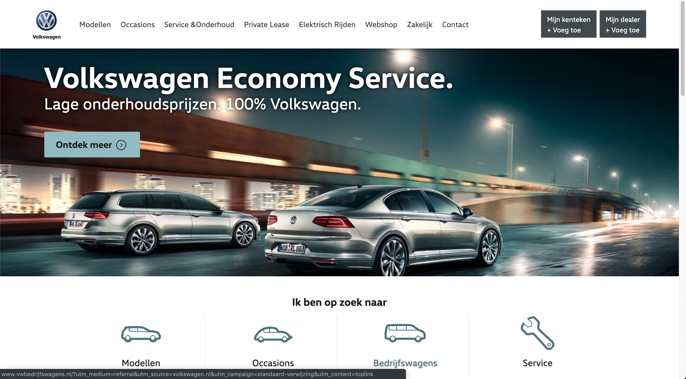

# | Project 2 | Valtech_ | Volkswagen |

**In this application I did some research on methods to improve the performance and accessability for [Volkswagen](https://www.volkswagen.nl/) through [Valtech_](https://www.valtech.com/nl-nl/) and tried to implement this within a certain timespan.**



## Table of Contents
* **[How to install](#how-to-install)** 
* **[Walktrough the application](#walk-trough-the-application)** 
* **[Performance features](#performance-features)**
* **[Service worker](#service-worker)**
* **[Learning process](#learning-process)**
* **[Resources](#resources)**
* **[Checklist](#checklist)**
* **[License](#license)**

## How to install

Before installing make sure you have installed node.js and npm.
Choose or make a new directory.
Load the template into your directory.

```bash
git clone https://github.com/chelseadoeleman/project-2-1819.git
```

Make sure you are in the right directory 
```bash
cd project-2-1819
```

Check if you have the latest version of npm.
Install the dependencies in [package.json](./package.json)
```bash
npm install
```

## Proof of Concept

At first I did some research as to what kind of performance features Volkwagen had already implemented. After running an audit it was safe to say, they didn't do too bad. Which was a relief, but was harder for me to come up with performance features. In de end I made an list with some features that will likely improve the performance and accessability of the application.

1.  [Precompress with brotli and gzip](#precompress-with-brotli-and-gzip)
2.  [Service Worker](#service-worker)
3.  [First paint](#first-paint)
4.  [Compress images with WebP](#compress-images-with-wepb)
5.  [Improve Accessability](#improve-accessability)


### Precompress with brotli and gzip

Precrompression (Static compression) saves a lot of time, over compressing files on-the-fly (Dynamic compression). That being said compressing your files can reduce it's file size and will save a lot of load time. Volkswagen did makes use of compressed files, but this was done dynamically, they also only supported gzip files. 

Brotli has a better compression ratio than gzip, for example an Javascript file compressed with gzip can be 14% bigger than if it were compressed with brotli. As of now not all browsers support brotli **.br** files, so gzip can be used as an fallback. Compressing files can save up to 10%-25%.


### Service worker

The service worker can cache files such as javascript, css and even webfonts. This means that when the user has a bad connection or is offline the user is still able to use the webpage. You can even cache a custom offline page so when the user is offline and there wasn't anything cached yet they are able to view that custom page. It is even possible to store images offline, although storing large images is ill advised. For the sake of this demo though I did store some images in the service worker.


### First paint

Perceived performance is important for the user, so while the page is still loading, they can have a glimpse at the content that is available for them at the moment before the fold. One thing that improve the load time is critical css. All the styling that is visible above the fold will be placed in a style tag in the head. Afterwards the rest of css will be loaded with javascript. This will improve the load time, so the user is able to view the content faster.

Another thing that is important for the first view is making sure the textual content is visible during font-load. Because volkswagen have their own font, this can be loaded with ```font-display: swap;```. This way while the font is loading the user is able to view the content faster, eventhough it is not rightly styled yet. Another important thing is to apply a fallback font. This was already done in the website.


### Compress images with WebP

The are a lot of large images loaded in the website, which take up a lot of load time. Volkswagen already used some sort of image lazy loading, which makes sure the load time is defered. However by compressing the images with WebP, the images will be a lot smaller. This reduces load time and cellular data. WebP is not largely supported yet, but other next-gen formats will also save up a lot of load time. I think will save the largest bulk while loading the webpage, because this can save up to 10 seconds.


### Improve Accessability

The accessability was not bad on the website. I could almost access every link with a screenreader, eventhough sometimes more information could be provided e.g **Lees meer**. After running an audit the most prominent thing that came forward, was that there wasn't enough contrast provided between the background and foreground. This was an easy fix. Focus styles also weren't applied everywhere, which is also important for the user when navigating through the page. The main problem was that HTML was not completely written semantically. Such as no labels provided for an input element or multiple id's.

Now there is enough color contrast between colors for people who are colorblind to discern. Though all the images can't be controlled the text over the images is still quite readable, maybe testing can give more insight into this matter.


## Learning process


## Resources

**Resources**
* [Express](https://expressjs.com/)
* [Node](https://nodejs.org/en/)
* [Helmet](https://github.com/helmetjs/helmet)
* [Node-fetch](https://www.npmjs.com/package/node-fetch)
* [Babel-polyfill](https://cdnjs.com/libraries/babel-polyfill)
* [Gulp](https://gulpjs.com/)
* [Ejs](https://ejs.co/)
* [Nodemon](https://nodemon.io/)
* [Service worker](https://developers.google.com/web/fundamentals/primers/service-workers/#you_need_https)

## License
This repository is licensed as [MIT](LICENSE) by [Chelsea Doeleman](https://github.com/chelseadoeleman).
